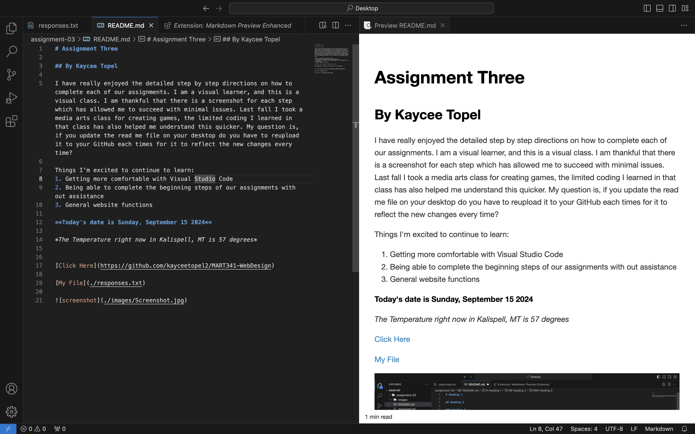

# Assignment Three

## By Kaycee Topel 

I have really enjoyed the detailed step by step directions on how to complete each of our assignments. I am a visual learner, and this is a visual class. I am thankful that there is a screenshot for each step which has allowed me to succeed with minimal issues. Last fall I took a media arts class for creating games, the limited coding I learned in that class has also helped me understand this quicker. My question is, if you update the read me file on your desktop do you have to reupload it to your GitHub each times for it to reflect the new changes every time? 

Things I'm excited to continue to learn:
1. Getting more comfortable with Visual Studio Code 
2. Being able to complete the beginning steps of our assignments with out assistance 
3. General website functions 

**Today's date is Sunday, September 15 2024**

*The Temperature right now in Kalispell, MT is 57 degrees*

[Click Here](https://github.com/kayceetopel2/MART341-WebDesign)

[My File](./responses.txt)

